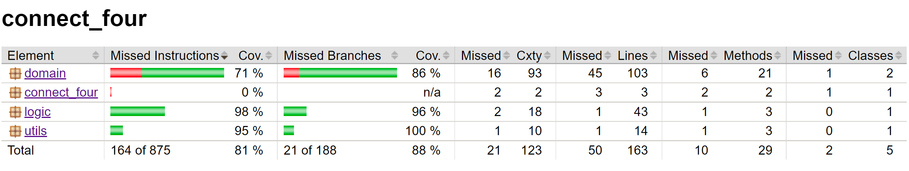

# Testing document

The project uses JUnit unit tests and Jacoco for test coverage. Tests and coverage report can be run from IDE or terminal.

## Unit tests

### BoardTest

The board class is tested to ensure the functionality of char array, which stores the current situation on the board.
Win checking method is also tested multiple times, with corner cases for the diagonal rows of four.

### AITest

The AI class is tested to ensure the functionality of the minimax algorithm. The minimax method is given game situations
where a win is achievable with a certain amount of moves and with certain depth. Then the moves chosen by the algorithm are asserted to find
out if they're right or not.

### UtilsTest

UtilsTest tests the Utils class, which is a small class for miscellaneous tools. The input validation method is test comprehensively with various inputs.

#### UtilsForTest

This class provides utilities for the tests.

### Test coverage

